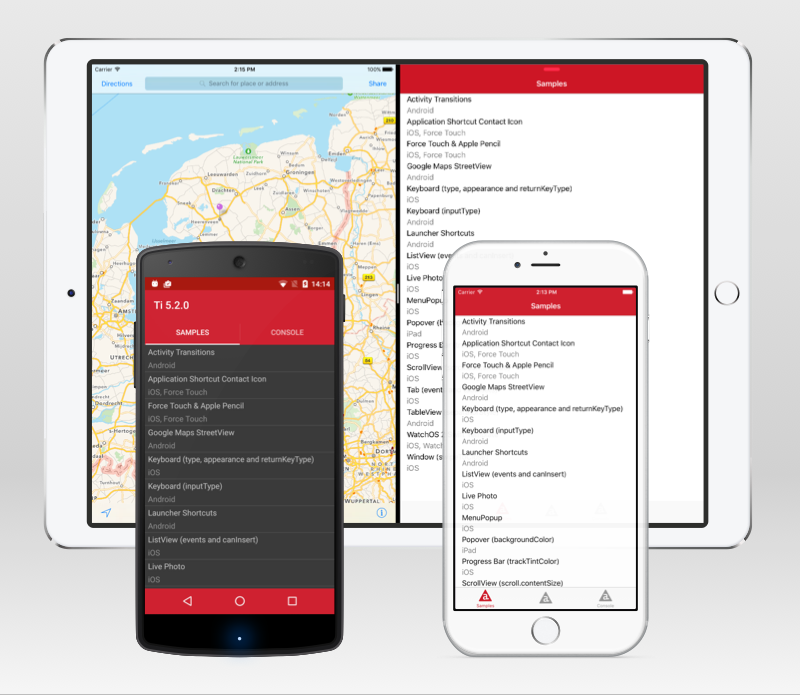

# Titanium 5.2.0 Sample App

> **NOTE:** This Sample App requires Titanium >=5.2.2<5.3 and Alloy >=1.8.5 (part of AppC CLI >=5.2.2). It supports Android 4.x and iOS 9.x. Some examples might be restricted to specific platforms or devices.

For more information on Titanium 5.2.0 see the [official announcement](http://www.appcelerator.com/blog/2016/02/ga-release-of-cli-5-2-titanium-5-2-and-studio-4-5/), which also links the release notes and full list of closed tickets.

## Walkthroughs

The examples and code itself should be fairly self explanatory, but we've published detailed walkthroughs on some of the main features:

* [Launch Files, iPad Pro, Slide Over and Split View](docs/launchfiles.md)
* [Live Photos](docs/livephotos.md)
* [Google Street View Panorama](docs/streetview.md)
* [Android Activity & Shared Element Transitions](docs/transitions.md)
* [Wrap-up for iOS](docs/ios.md)
* [Wrap-up for Android](docs/android.md)

## Running the Sample

### Via Appcelerator Studio

1. Import it via *Dashboard* if available.
2. Or import it via *File > Import... > Git > Git Repository as New Project* with *URI*:

		https://github.com/appcelerator-developer-relations/appc-sample-ti520

3. Select a Simulator or Device to build to via *Run > Run As*.

### Via CLI

1. Clone the repository:

		git clone https://github.com/appcelerator-developer-relations/appc-sample-ti520

2. To run it with `appc run` first import it to the platform:

		appc new --import --no-services

3. Build to Simulator or Device:

		[appc run | ti build] -p ios [-T device]
