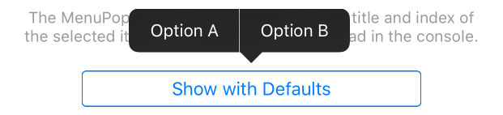
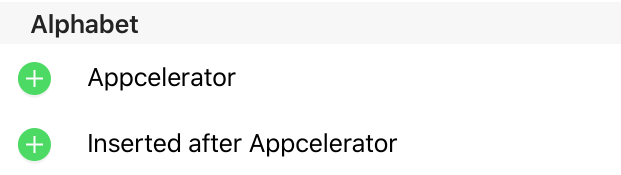
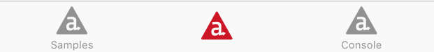

# Titanium 5.2.0: Wrap-up for iOS

Let's wrap-up our tour through the [Sample App](http://github.com/appcelerator-developer-relations/appc-sample-ti520) for [Titanium 5.2.0](http://www.appcelerator.com/blog/2016/02/ga-release-of-cli-5-2-titanium-5-2-and-studio-4-5/) before 5.2.1 arrives. I'll briefly introduce you to some of the remaining new features and changes.

Let's start with iOS:

* [MenuPopup](#menupopup)
* [3D Touch & Apple Pencil Events](#3d-touch--apple-pencil-events)
* [WatchOS2 Swift Template](#watchos2-swift-template)
* [ListView Insertion Control & Drag Events](#listview-insertion-control--drag-events)
* [Tab Icon Insets](#tab-icon-insets)
* [Updating User Activities](#updating-user-activities)
* [Small but not forgotten](#small-but-not-forgotten)
* [Renamed APIs](#renamed-apis)

## MenuPopup

The last remaining new UI component added in this release is [Ti.UI.iOS.MenuPopup](http://docs.appcelerator.com/platform/latest/#!/api/Titanium.UI.iOS.MenuPopup) which implements [UIMenuController](https://developer.apple.com/library/prerelease/ios/documentation/iPhone/Reference/UIMenuController_Class/index.html). In TextFields and TextAreas these popup automatically with edit options like cut, copy, paste etc. Alloy support is [under way](https://jira.appcelerator.org/browse/ALOY-1357), so open the [menupopup.js](../app/controllers/ios/menupopup.js) controller to see how we instantiate and configure this menu to show with any view.

## 3D Touch & Apple Pencil Events

We've added new events to the [touch*](http://docs.appcelerator.com/platform/latest/#!/api/Titanium.UI.View-event-touchstart), `click` and `dblclick` events for use with 3D Touch and Apple Pencil. Playback the above video to see how the [touch.xml](../app/views/ios/touch.xml) view allows you to try them out with some nice visual feedback using `force` and `maximumPossibleForce`.

## WatchOS2 Swift Template

When you add an WatchOS2 extension to your Titanium iOS app using `appc create` you will now get a [Swift template](../extensions/Ti 5.2.0/Ti 5.2.0 WatchKit Extension). The Objective-C template is still available by using `appc create -t applewatch --template watchos2-objc`. We've also cleaned up the template to include nothing more than Xcode does, except for some [icons](../extensions/Ti 5.2.0/Ti 5.2.0 WatchKit App/Assets.xcassets/AppIcon.appiconset/) and an example of how to [initiate a Watch Connectivity Session](../extensions/Ti 5.2.0/Ti 5.2.0 WatchKit Extension/InterfaceController.m#L22-L29).

The sample comes with the default WatchOS2 extension and the [watchos.js](../app/controllers/ios/watchos.js) controller lets you confirm the Watch Connectivity Session has been established.

## ListView Insertion Control & Drag Events

As the video demonstrates, you can now enable the [Insertion control](https://developer.apple.com/library/ios/documentation/UserExperience/Conceptual/TableView_iPhone/ManageInsertDeleteRow/ManageInsertDeleteRow.html) just like you could already enable the Deletion control. Identical to [delete](http://docs.appcelerator.com/platform/latest/#!/api/Titanium.UI.ListView-event-delete), you will need to listen to the ([undocumented](https://jira.appcelerator.org/browse/TIDOC-2481)) `insert` event to do the actual insert as demonstrated in the [listview.js](../app/controllers/ios/listview.js) controller.

There's two more new events. Like TableView and ScrollView, ListView now also has `dragstart` and `dragend` events. The sample demonstrates both.

## Tab Icon Insets

If you don't give your tab a title, the icon would still show at the same place to line up with other tabs that might still have a title. You can now [set insets](../app/styles/tab.tss) to shift the icon:

## Updating User Activities

Finally, we need to talk about `Ti.App.iOS.UserActivity`. Originally we modelled this very close to the iOS API. To update an activity you would do set its `needsSave` property to `true` and then wait for the `useractivitywillsave` event to do the actual update. We've now simplified this. You'll make the changes right away and then set the `needsSave` property to inform iOS, as demonstrated in [index.js](../app/controllers/index.js#L63).

## Small but not forgotten
But let's not forget that with Titanium 5.2.0 for iOS you can also:

* [Set the color](../app/styles/ios/progressbar.tss#L6) of the uncompleted track of an `Ti.UI.ProgressBar`.
* [Set the backgroundColor](../app/controllers/ios/popover.js#L3) of `Ti.UI.iPad.Popover` so that its arrow can match the backgroundColor of the ContentView.
* [Prevent](../app/styles/ios/window.tss) a `Ti.UI.Window` inside a `Ti.UI.iOS.NavigationWindow` to be closed by swiping form the left edge of the screen.
* [Use](../app/controllers/ios/appshortcuts.js#L45) a `Ti.Contacts.Person` for the icon of `Ti.UI.iOS.ApplicationShortcuts` to display their photo or initials.
* [Listen to the scroll-event](../app/views/ios/scrollview.xml) of a `Ti.UI.ScrollView` to get the `contentSize`, just like with a TableView.
* [Use two new keyboard-types](../app/views/ios/keyboard.xml) and a a new *Continue* return key type in TextFields and TextAreas.

## Renamed APIs

We've also deprecated and renamed some APIs to improve the consistency of our APIs. The old will be removed in Titanium 6.0.

| Old | New |
| --- | --- |
| `Ti.UI.Tab.(blur/focus)` | `Ti.UI.Tab.(un)?selected`
| `Ti.UI.TabGroup.(un)?selected` | `Ti.UI.TabGroup.(blur/focus)`
| `Ti.UI.(TextArea/Field).appearance` | `Ti.UI.(TextArea/Field).keyboardAppearance`
| `Ti.UI.KEYBOARD_*` | `Ti.UI.KEYBOARD_TYPE_*` and `Ti.UI.KEYBOARD_APPEARANCE_*`
| `Ti.UI.KEYBOARD_APPEARANCE_ALERT` | `Ti.UI.KEYBOARD_APPEARANCE_DARK`
| `Ti.Calendar.STATUS_CANCELLED` | `Ti.Calendar.STATUS_CANCELED`
| `Ti.Calendar.eventsAuthorization` | `Ti.Calendar.calendarAuthorization`
| `Ti.Calendar.CAMERA_AUTHORIZATION_NOT_DETERMINED` | `Ti.Calendar.CAMERA_AUTHORIZATION_UNKNOWN`
| `Ti.Media.cameraAuthorizationStatus` | `Ti.Media.cameraAuthorization`

Code Strong 🚀
