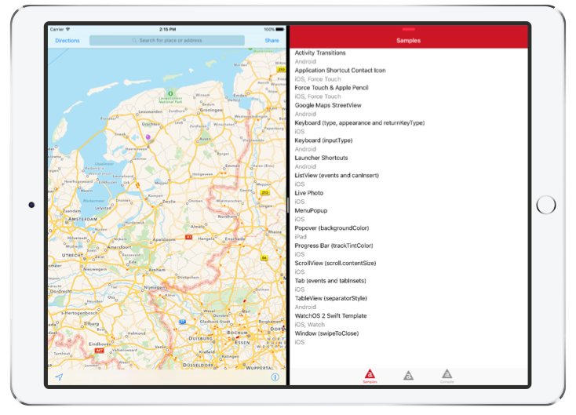
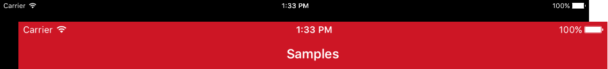
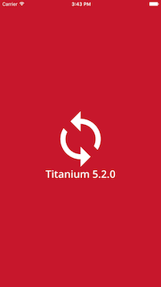
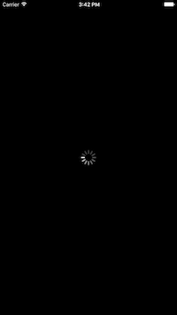
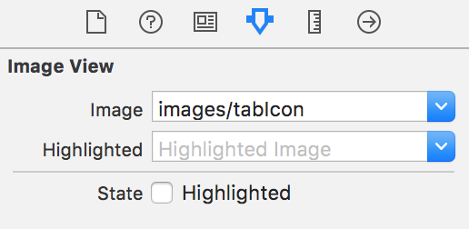
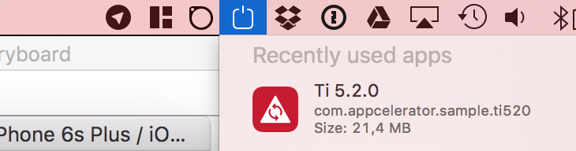

### Titanium 5.2.0: Launch Files, iPad Pro, Slide Over and Split View

With iOS 9 Apple introduced [Slide Over and Split View](https://developer.apple.com/library/prerelease/ios/documentation/WindowsViews/Conceptual/AdoptingMultitaskingOniPad/QuickStartForSlideOverAndSplitView.html) for multitasking on eligible iPad models. You can now enable these new features for your apps in [Titanium 5.2.0](http://www.appcelerator.com/blog/2016/02/ga-release-of-cli-5-2-titanium-5-2-and-studio-4-5/).

In this blog post I'll walk you through all of this using the new [Titanium 5.2.0 Sample App](http://github.com/appcelerator-developer-relations/appc-sample-ti520):

#### Not a small thing

Supporting these new features actually was quite an undertaking. We needed to refactor our custom layout engine to use [Auto Layout](https://developer.apple.com/library/ios/documentation/UserExperience/Conceptual/AutolayoutPG/index.html), which we did for Titanium 5.1.0 as an [opt-in](http://docs.appcelerator.com/platform/latest/#!/guide/Titanium_SDK_5.1.0_Release_Note-section-46239771_TitaniumSDK5.1.0ReleaseNote-AutoLayout). The other ingredient were [Launch Files](https://developer.apple.com/library/ios/documentation/UserExperience/Conceptual/MobileHIG/LaunchImages.html), now available in Titanium 5.2.0. This also gets us support for the [iPad Pro](http://www.apple.com/ipad-pro/), which no longer supports Launch Images.

#### What are Launch Files?

Until now, you used to create a bunch of `Default*.png` Launch Images. In iOS 8 Apple introduced [Launch Files](https://developer.apple.com/library/ios/documentation/UserExperience/Conceptual/MobileHIG/LaunchImages.html). These are the same XIB files or Storyboards that you'd normally build you UI with in Xcode. This means you can use any iOS UI component and only need one file to support all devices. When you app first runs, iOS takes a snapshot image of the launch file to use as launch image. A great way to slim down your IPA!

#### iPad Pro requires Launch Files

The iPad Pro no longer supports Launch Images. Without it, a (Titanium) iOS app will be stretched to fit the iPad Pro:

The iPad Pro also requires a new 167px icon called `appicon-83.5@2x.png`. If you use [DefaultIcon[-ios].png](http://docs.appcelerator.com/platform/latest/#!/guide/Icons_and_Splash_Screens-section-29004897_IconsandSplashScreens-iOSgraphicassetrequirementsandoptions) it will be generated automatically since Titanium 5.1.2.GA.

You can select the iPad Pro from the device list in Studio or use `-C ?` to select if from the CLI.

#### Using Launch Files

You have two ways to use Launch Files: by using our builtin Storyboard or your own.

Both need to be enabled in the `<ios>` section of your [tiapp.xml](https://github.com/appcelerator-developer-relations/appc-sample-ti520/blob/master/tiapp.xml#L28):

	<enable-launch-screen-storyboard>true</enable-launch-screen-storyboard>

#### Option A: Use the builtin Storyboard

The builtin Storyboard features a centered image on a solid background color. The sample uses the builtin storyboard with a [custom image](https://github.com/appcelerator-developer-relations/appc-sample-ti520/tree/master/app/assets/iphone) on an [Appcelerator red Background Color](https://github.com/appcelerator-developer-relations/appc-sample-ti520/blob/master/tiapp.xml#L31):

##### Customising the Image

By default we'll generate the image from `DefaultIcon[-ios].png`. To use a different image, add the following `LaunchLogo*.png` files to the [app/assets/iphone](https://github.com/appcelerator-developer-relations/appc-sample-ti520/tree/master/app/assets/iphone) folder:

Filename | Devices | Scale | Recommended Size
---------|---------|-------|-----------------
LaunchLogo~iphone.png | iPhone 3G and older | 1x | 320x320
LaunchLogo@2x~iphone.png | iPhone 4, 4s 5, 5s, 6, 6s | 2x | 374x374
LaunchLogo@3x~iphone.png | iPhone 6 Plus, 6s Plus | 3x | 621x621
LaunchLogo~ipad.png | iPad 1, 2, Mini 1 | 1x | 384x384
LaunchLogo@2x~ipad.png | iPad 3, 4, Air, Air 2, Mini 2, 3, 4 | 2x | 1024x1024

You can generate these images with TiCons [Web](http://ticons.fokkezb.nl/) or [CLI](https://www.npmjs.com/package/ticons) `--storyboard` option.

##### Customising the Background Color

By default the background color is white. You can set a different color via the `<ios>` section of your [tiapp.xml](https://github.com/appcelerator-developer-relations/appc-sample-ti520/blob/master/tiapp.xml#L31).

This will also change the background color of your app between after the launch files is dismissed and before a view (with a solid background color) is opened, or [Ti.UI.backgroundColor](http://docs.appcelerator.com/platform/latest/#!/api/Titanium.UI-property-backgroundColor) is set. The sample [opens with a 2s delay](https://github.com/appcelerator-developer-relations/appc-sample-ti520/blob/master/app/controllers/index.js#L23-L30) so you can see this better.

#### Option B: Use a custom Storyboard

To use a custom Storyboard, put this file in [platform/ios/LaunchScreen.storyboard](https://github.com/appcelerator/titanium_mobile/blob/master/iphone/iphone/LaunchScreen.storyboard). As you can see the sample has it disabled using a `_` prefix. Just remove the underscore and do a clean build to see the difference:

As you can see I've used an iOS Activity Indicator. Notice that it is not spinning as iOS uses a snapshot image of the storyboard.

##### Using images

To use an image in your custom Storyboard, simply set the `Image` property of an *Image View* to the path under `app/assets/` without the image modifier (`~ipad`, `@2x`) or extension:

> **NOTE:** [Currently](https://jira.appcelerator.org/browse/TIMOB-20429) Titanium does not package the `LaunchLogo*.png` file if you use a custom storyboard. You need to rename this image before you can use it.

If you have the [optional app-thinning](http://docs.appcelerator.com/platform/latest/#!/guide/tiapp.xml_and_timodule.xml_Reference-section-29004921_tiapp.xmlandtimodule.xmlReference-use-app-thinning) enabled, you will have to use the name of the generated asset catalog. This is a hash based on the image path. To find out the hash for your image build the app, look up the right `[hash].imageset` under `build/iphone/Assets.xcassets/` and use the `[hash]` part.

#### Dealing with Launch File Cache

As you modify the (custom) storyboard, you might not always see your changes immediately. This is because iOS caches the snapshot it makes from your Launch File and a [known issue](https://jira.appcelerator.org/browse/TIMOB-20430) where Titanium does not always recompile the storyboard.

To deal with this follow these steps before you build:

1. Use <em>Simulator > Reset Content and Settings...</em>
2. Use <em>Project > Clean...</em> or `appc ti clean` from CLI.

Alternatively you can reset an individual app using a tool like [SimPholders](https://simpholders.com/). With this app, just hold `alt/⌥` and click the app from the dropdown:

#### Enabling Slide Over and Split View

On to iPad multitasking.

The reason this requires Launch Files is that your app might be opened as Slide Over in either landscape or portrait. This would have required a 6 more launch images for the 3 sizes of iPad screens out there.

Because your app needs to deal with all these sizes as well, Auto Layout is required. So the first thing we need to do is enable this under the `<ios>` section of [tiapp.xml](https://github.com/appcelerator-developer-relations/appc-sample-ti520/blob/master/tiapp.xml#L34):

	<use-auto-layout>true</use-auto-layout>
	
To inform iOS that our app no longer requires fullscreen, we need to add a flag to the `<ios><plist><dict>` section of [tiapp.xml](https://github.com/appcelerator-developer-relations/appc-sample-ti520/blob/master/tiapp.xml#L40-L41):

	<key>UIRequiresFullScreen</key>
	<false/>

#### Responding to Slide Over and Split View

Though Auto Layout should take care of resizing your UI properly, you might want to leave out certain views on smaller sizes.

To respond to your app changing between full screen, Slide Over and quarter or half Split View you can listen to the existing [Ti.App:resumed](http://docs.appcelerator.com/platform/latest/#!/api/Titanium.App-event-resumed) event. This will fire on all occasions [except for one](https://jira.appcelerator.org/browse/TIMOB-20461). When your app is on the left side of a Split View and moves back to fullscreen because the other app closes or switches to Slide Over you will not get notified.

In [index controller](https://github.com/appcelerator-developer-relations/appc-sample-ti520/blob/master/app/controllers/index.js#L105) of the sample app I log the dimensions of the TabGroup each time the `resumed` event is received.