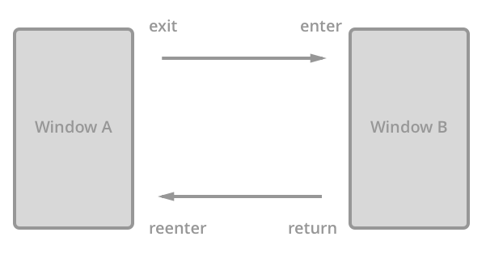

# Titanium 5.2.0: Android Activity & Shared Element Transitions

Android 5.0 (API level 21) introduced [Material Design](http://developer.android.com/design/material/index.html): a vision, [design guidelines](http://www.google.com/design/spec/material-design/introduction.html) as well as new components and animations. Earlier in Titanium 5.1.0 we added support for [CardView](https://github.com/appcelerator-developer-relations/appc-sample-ti510#cardview), the [Reveal Effect](https://github.com/appcelerator-developer-relations/appc-sample-ti510#reveal-effect) animation as additional support for the [material design theme](https://github.com/appcelerator-developer-relations/appc-sample-ti510#progressbar-color).

Now in [Titanium 5.2.0](http://www.appcelerator.com/blog/2016/02/ga-release-of-cli-5-2-titanium-5-2-and-studio-4-5/) we add support for customized [Activity & Shared Element Transitions](https://developer.android.com/training/material/animations.html#Transitions). In this blog post I'll walk you through this using the new [Titanium 5.2.0 Sample App](http://github.com/appcelerator-developer-relations/appc-sample-ti520):

[](https://www.youtube.com/watch?v=Cg8HmQBP4jk)

## What is an Activity?
In Titanium each Window or TabGroup creates and is linked to a new [Activity](http://developer.android.com/guide/components/activities.html). When the user presses the [system back button](http://developer.android.com/training/implementing-navigation/temporal.html) he will return to the previous activity on the stack. You can access the Activity via the [activity property](http://docs.appcelerator.com/platform/latest/#!/api/Titanium.UI.Window-property-activity).

## What Activity Transitions are there?

It's important to understand the difference between the different transitions an activity goes through that you can customize. You can see all four of them explained in the following diagram:



As you go from Window A to B, Window A will **exit** and B will **enter**. When you press the system back button to return to Window A, then Window B will **return** and A will **reenter**.

> **NOTE:** It's a known issue that when you programmatically close a Window using its `close()` the **return** and **reenter** transitions are ignored ([TIMOB-20451](https://jira.appcelerator.org/browse/TIMOB-20451)). The system back button shows the expected behaviour.

For more details I recommend Alex Lockwood's [Getting Started with Activity & Fragment Transitions](http://www.androiddesignpatterns.com/2014/12/activity-fragment-transitions-in-android-lollipop-part1.html).

## How to customize Activity Transitions?

First of all, the Android APIs are designed in such a way that as soon as you define shared elements, both the `activity*Transition`s and `sharedElement*Transition`s get defaults (which I'll get to soon) that you're unlikely to need to change at all.

> **NOTE:** Currently Activity Transitions will only work if you have declared shared elements. We're looking into making them work without as well ([TIMOB-20507](https://jira.appcelerator.org/browse/TIMOB-20507)).

To customize the transitions you can use the following properties:

* `Ti.UI.Window.activityExitTransition`
* `Ti.UI.Window.activityEnterTransition`
* `Ti.UI.Window.activityReturnTransition`
* `Ti.UI.Window.activityReenterTransition`

> **NOTE:** Unfortunately the API reference of these properties currently has them located under the Window `open()` and `close()` [parameters](http://docs.appcelerator.com/platform/latest/#!/api/openWindowParams) ([TIDOC-2454](https://jira.appcelerator.org/browse/TIDOC-2454)).

The above properties can be set to the following constants:

* [`Ti.UI.Android.TRANSITION_EXPLODE`](http://docs.appcelerator.com/platform/latest/#!/api/Titanium.UI.Android-property-TRANSITION_EXPLODE)
* [`Ti.UI.Android.TRANSITION_FADE_IN`](http://docs.appcelerator.com/platform/latest/#!/api/Titanium.UI.Android-property-TRANSITION_FADE_IN)
* [`Ti.UI.Android.TRANSITION_FADE_OUT`](http://docs.appcelerator.com/platform/latest/#!/api/Titanium.UI.Android-property-TRANSITION_FADE_OUT)
* [`Ti.UI.Android.TRANSITION_SLIDE_TOP`](http://docs.appcelerator.com/platform/latest/#!/api/Titanium.UI.Android-property-TRANSITION_SLIDE_TOP)
* [`Ti.UI.Android.TRANSITION_SLIDE_RIGHT`](http://docs.appcelerator.com/platform/latest/#!/api/Titanium.UI.Android-property-SLIDE_RIGHT)
* [`Ti.UI.Android.TRANSITION_SLIDE_BOTTOM`](http://docs.appcelerator.com/platform/latest/#!/api/Titanium.UI.Android-property-SLIDE_BOTTOM)
* [`Ti.UI.Android.TRANSITION_SLIDE_LEFT`](http://docs.appcelerator.com/platform/latest/#!/api/Titanium.UI.Android-property-SLIDE_LEFT)
* [`Ti.UI.Android.TRANSITION_NONE`](http://docs.appcelerator.com/platform/latest/#!/api/Titanium.UI.Android-property-TRANSITION_NONE)

The sample lets you [set these properties](../app/views/android/transitions_a.xml#L8) from within the app to play with the options.

### Transition defaults
In most cases you will only set **enter** and **exit** because **reenter** will default to **exit** as will **return** to **enter**. In turn, **exit** defaults to no animation and **enter** to `FADE_INT`.

### Disable transitions
You can disable transitions at all time by passing `{animated:false}` to the Window `open()` or `close()` method. As mentioned, they will currently also not be used if you don't declare any shared elements.

## What Shared Element Transitions are there?
Again, Alex Lockwood does a great job at explaining working with [Shared Elements](http://www.androiddesignpatterns.com/2015/01/activity-fragment-shared-element-transitions-in-depth-part3a.html).

What it comes down to is that as you transition from one Window to the next you can link individual related views between both Windows and have them animate from one to the other as if they were one.

If you scroll back to the screenrecording of our Sample App you can see that the Appcelerator logo and the next underneath display this behaviour. Again, the sample allows you to change the transition style for these shared elements.

## How to customize Shared Element Transitions?

Like I said the Android APIs are designed in such a way that you're unlikely to want to change the defaults. But as with Activity Transitions, we have four properties we can use to do so anyway. Their names might be very similar to those for the Activity Transitions, but their meaning is slightly different.

> **NOTE:** Unfortunately the API reference of these properties currently has them located under the Window `open()` and `close()` [parameters](http://docs.appcelerator.com/platform/latest/#!/api/openWindowParams) ([TIDOC-2454](https://jira.appcelerator.org/browse/TIDOC-2454)).

Let's start with two properties you can set on Window B:

* `Ti.UI.Window.activitySharedElementEnterTransition` to determine how shared elements animate from A to B. Defaults to all of them in parallel.
* `Ti.UI.Window.activitySharedElementReturnTransition` to determine how shared elements animate form B to A. Defaults to all of them in parallel.

Additionally you can also set two properties on Window A. Now as Alex [points out](http://www.androiddesignpatterns.com/2015/01/activity-fragment-shared-element-transitions-in-depth-part3a.html#footnote1)  there are very use cases for these two. In fact, the animations Titanium currently exposes would not be noticeable.

* `Ti.UI.Window.activitySharedElementExitTransition` animates shared elements **before** they use B's **enter** transition to animate from A to B.
* `Ti.UI.Window.activitySharedElementReeenterTransition` animated shared elements **after** they use B's **return** transition to animate from B to A. Defaults to the **exit** transition.

You can set these four properties to the following constants:

* [`Ti.UI.Android.TRANSITION_CHANGE_BOUNDS`](http://docs.appcelerator.com/platform/latest/#!/api/Titanium.UI.Android-property-TRANSITION_CHANGE_BOUNDS)
* [`Ti.UI.Android.TRANSITION_CHANGE_CLIP_BOUNDS`](http://docs.appcelerator.com/platform/latest/#!/api/Titanium.UI.Android-property-TRANSITION_CLIP_BOUNDS)
* [`Ti.UI.Android.TRANSITION_CHANGE_TRANSFORM`](http://docs.appcelerator.com/platform/latest/#!/api/Titanium.UI.Android-property-TRANSITION_CHANGE_TRANSFORM)
* [`Ti.UI.Android.TRANSITION_CHANGE_IMAGE_TRANSFORM`](http://docs.appcelerator.com/platform/latest/#!/api/Titanium.UI.Android-property-TRANSITION_CHANGE_IMAGE_TRANSFORM)
* [`Ti.UI.Android.TRANSITION_NONE`](http://docs.appcelerator.com/platform/latest/#!/api/Titanium.UI.Android-property-TRANSITION_NONE)

## How to define Shared Elements to enable these Transitions?

Now how do we put all these properties and constants into use and actually define Shared Elements so that we can see both the Activity and Shared Element Transitions in action?

1. In both Windows we need to set the new [transitionName](http://docs.appcelerator.com/platform/latest/#!/api/Titanium.UI.View-property-transitionName) property to the same value for each shared element. You can see we've done this in [Window A](../app/views/android/transitions_a.xml#L66-L67) and [Window B](../app/views/android/transitions_b.xml#L7-L9) of our Sample App. The name should be unique within each Window.
2. Before we open Window B we then need to use its new [addSharedElement()](http://docs.appcelerator.com/platform/latest/#!/api/Titanium.UI.Window-method-addSharedElement) method. This method takes two properties. The first should be a reference to the shared view in Window A. The second is the value of `transitionName` as it can be found in Window B.

Sounds confusing?

Have a look at the Sample's [transitions_a.xml](../app/views/android/transitions_a.xml#L66-L67), [transitions_b.xml](../app/views/android/transitions_b.xml#L7-L9) and [transition_a.js](../app/controllers/android/transitions_a.js#L30-L31). In the end, when you rely on the default transition animations, this is all you need to set.

In both views:

```
<ImageView transitionName="logo" .. />
<Label transitionName="text"> .. </Label>
```

In the controller for Window A, before opening Window B:

```
win.addSharedElement($.logo, 'logo');
win.addSharedElement($.text, 'text');
```

Let's make some truly *animating* Titanium Android apps!

\- Code Strong 🚀
